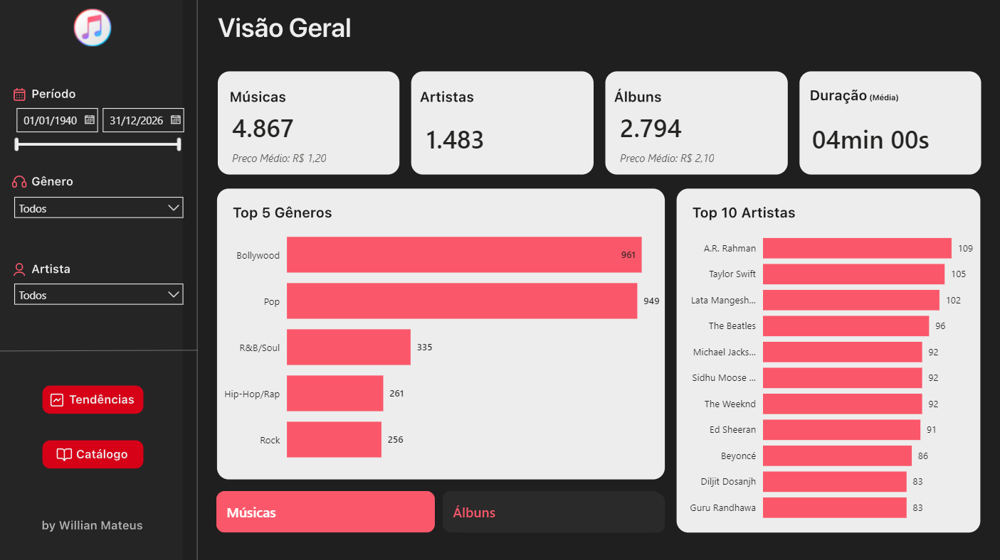

# 📊 Dashboard | Análise de Mercado iTunes

> **🔗 Acesso Rápido:** [clique aqui para acessar o Dashboard Interativo Online](https://app.powerbi.com/view?r=eyJrIjoiNmEwZmExNjItODdmZC00ZDEyLTllOGItZWZkYjYwZjYxNDUzIiwidCI6IjI3ODJkNTJlLWQ0ZTMtNDgzZC05OTk1LThiZDljY2UyZTM2NCJ9&pageName=1928c8d314c40bf173cb)

## 🏢 Cenário de Negócio
Este projeto simula um desafio real de Business Intelligence, onde o objetivo principal da análise é mapear o comportamento do mercado na plataforma iTunes para embasar estratégias de lançamento (músicas, álbuns) de novos artistas. Precisamos entender o padrão de precificação, aceitação de gêneros musicais e identificar tendências históricas de consumo.

## 🎯 Principais Funcionalidades
O painel foi estruturado em três visões estratégicas:

* **Visão Geral:** Quem são os maiores artistas do catálogo? Qual é a média de preço praticada pelo mercado e quais gêneros dominam a plataforma?
* **Tendências:** Como o comportamento de produção mudou ao longo das décadas? A duração das músicas está diminuindo com a nova era do streaming rápido?
* **Catálogo:** Uma ferramenta de "raio-x" interativa que permite pesquisar músicas específicas e visualizar a composição completa de seus respectivos álbuns.

## 🛠️ Tecnologias e Processos Aplicados

O projeto englobou um fluxo completo de dados, desde a extração até a visualização:

* **Python:** Utilizado na etapa inicial (Jupyter Notebook) para Análise Exploratória de Dados (EDA), tratamento inteligente de valores nulos (substituição por medianas agrupadas) e geração de insights.
* **Power BI & DAX:** Desenvolvimento do modelo semântico, criação de medidas dinâmicas e visualização de dados.
* **Power Query:** Etapas adicionais de ETL integradas ao modelo do Power BI.
* **Figma:** Construção de um background e design focado em minimalismo e usabilidade (UI/UX).

## 🐍 Análise em Python (Jupyter Notebook)
O arquivo `.ipynb` contendo o passo a passo da Análise Exploratória de Dados (EDA), tratamentos e geração de insights está disponível [clicando aqui](./notebook/analise.ipynb).

## 🎨 Design (UI/UX)
Para acessar o arquivo do design do dashboard [clique aqui](https://www.figma.com/design/1PnyPKkVkXpqGEHb8ZzUMI/DASHBOARD_ITUNES?node-id=0-1&t=j4MjQoDVx9zK2695-1).

## 🗂️ Base de Dados
Os dados brutos utilizados para este estudo foram extraídos do [iTunes Music Dataset (Kaggle)](https://www.kaggle.com/datasets/ashyou09/itunes-music-dataset).

## 👤 Autor

**Willian Mateus** | *Data Analyst & BI*

 ℹ️ Para saber mais sobre mim, ver meus outros projetos ou entrar em contato, visite meu [Perfil do GitHub](https://github.com/WillianMateus4)